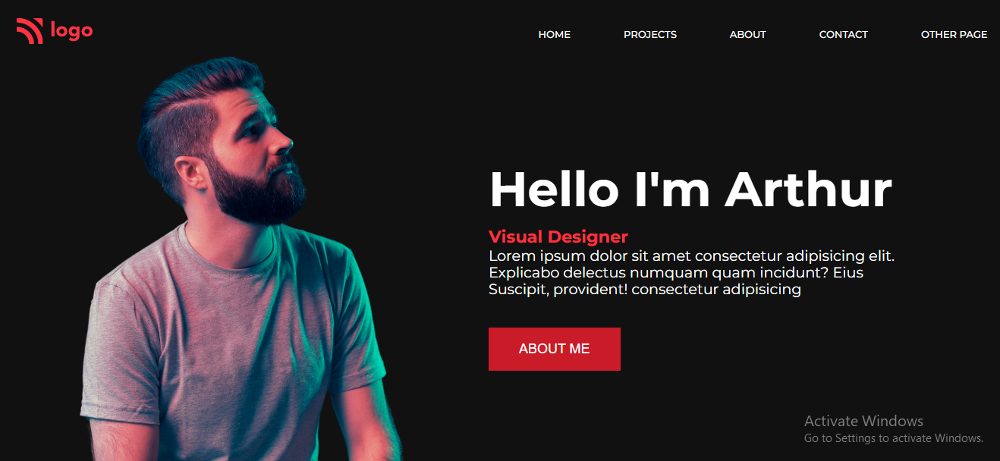

# Project 15 : Product Landing Page

### What I Learned from this Project?

- Learned to use flex grow, shrink & basis
- Learned about various CSS Properties
- Used various Psuedo Classes.

### This project took around 7 hours to complete.

### Project Link : [Link](https://proj-15-product-landing-page.netlify.app/)

### Screenshot

